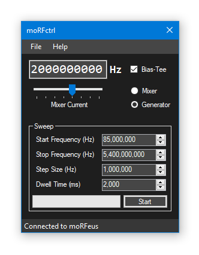

# moRFctrl
moRFctrl is a software utility for the [Othernet](https://othernet.is) [moRFeus](https://othernet.is/products/morfeus-1) RF signal generator/mixer. It can be used to manually set moRFeus parameters (i.e. frequency, mixer current, bias tee, function) and has a step generator for [measuring frequency response of filters and antennas](https://www.rtl-sdr.com/using-an-rtl-sdr-and-morfeus-as-a-tracking-generator-to-measure-filters-and-antenna-vswr/).

Uses [HIDSharp](https://www.zer7.com/software/hidsharp) v2.0.5 ([license](https://github.com/sam210723/moRFctrl/blob/master/HIDSharp/HIDSharp%20LICENSE.txt)).
